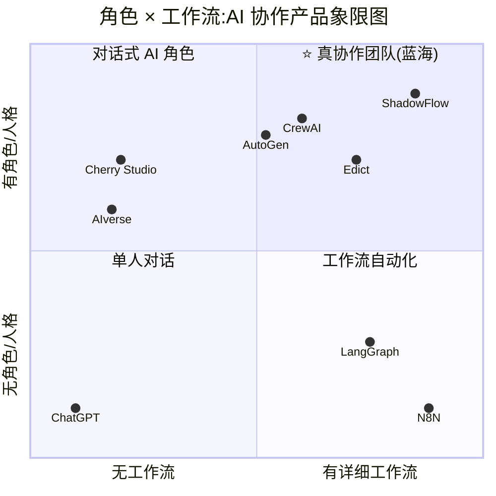

# ShadowFlow Product Brief

## 零、Slogan

> **ShadowFlow —— 让每个人都能设计自己的 AI 协作团队,团队本身是链上资产。**

## 一、产品定位

**ShadowFlow 是一个 AI 工作平台。**

用户在这个平台上做四件事:

1. **设计** —— 自定义 Agent 团队的角色、人格(SOUL prompt)、可用工具、所属 LLM
2. **立法** —— 画权限矩阵:谁能给谁发消息、谁能驳回谁、谁能对谁授权
3. **编排** —— 定义 stage / lane / 并行分支 / 审议节点
4. **传承** —— 把团队模板铸成链上资产,自用、分享、交易

平台面向的是"**希望用 AI 干复合任务,但又不想被预设工作流束缚**"的用户和团队。

## 二、问题陈述

当前 AI 协作产品只占了「角色 × 工作流」象限的一半,并且**可视化产品普遍缺位**。

### 竞品象限定位图

### 象限解读

- **右上(蓝海)** ShadowFlow:既有详细工作流,又有原生角色人格,还加权限治理
- **左上** Cherry Studio / AIverse:有角色人格,但协作机制弱、无详细工作流
- **中上** AutoGen / CrewAI / Edict:有角色有流程,但要写代码(AutoGen/CrewAI)或固定架构(Edict)
- **右下** LangGraph / N8N:工作流能力强,但节点本身**无原生角色抽象**,要自己拼
- **左下** ChatGPT:单人对话框

### 痛点总结

| 类别 | 代表产品 | 短板 |
|------|----------|------|
| **对话式 AI** | ChatGPT、Cherry Studio | 能聊不能组织多步协作;Agent 无分工审议 |
| **工作流自动化 / 图引擎** | N8N、LangGraph | 流程强,但节点无原生角色人格(LangGraph 要自己写,N8N 压根没有)|
| **代码型多 agent 框架** | AutoGen、CrewAI | 有角色有流程,但**必须写代码**,门槛高,非可视化 |
| **AI 角色 NFT** | AIverse、Ghast | 铸造**单个** AI Agent,不是"协作团队";无详细工作流、无权限治理 |
| **固定制度编排** | Edict 三省六部 | 架构写死,用户无法自定义组织形态 |

## 三、技术对标(为评委与技术审稿人)

ShadowFlow 融合了三个主流框架的核心能力,并补上它们共同缺失的两件事:

| 能力来源 | 我们借鉴的 | 我们补上的 |
|---------|-----------|------------|
| **AutoGen** | 多 agent 审议对话(质疑、驳回、重议) | — |
| **LangGraph** | 状态机式工作流(stage、条件边、并行/汇合) | — |
| **CrewAI** | 角色/任务抽象(crew → role → task) | — |
| **ShadowFlow** | — | **可视化设计** + **链上治理/资产** |

一句话:**"AutoGen 的对话、LangGraph 的状态机、CrewAI 的角色,加上它们都没做的可视化和链上化。"**

## 四、目标用户

**首批用户(黑客松演示侧重):**
- **一人公司 / Solopreneur**:一个人要做完 CEO + 营销 + 设计 + 客服 + 法务,最需要"AI 员工团队"做分身;付费意愿最强
- **内容创作者 / 新闻工作室**:需要"主编 / 记者 / 审校 / 法务"的多审流程
- **小型咨询团队**:需要"研究员 / 分析师 / 复核 / 交付"的四角协作
- **Web3 社区 / DAO**:对"组织架构本身上链"天然共鸣

**二期用户:**
- 企业团队(多人共享 Agent 团队,记忆互通)
- Agent 团队模板的开发者与买家(链上市场)

**特意不追求:**
- 已写代码的开发者(他们会继续用 AutoGen/LangGraph/CrewAI)
- 想要上千个集成的自动化用户(他们用 N8N)

## 五、核心解决方案

用户在一次使用中完成 5 个动作:

1. **设计**:拖出角色卡,每个角色配 SOUL(职责 prompt)、可用 LLM、可用工具
2. **立法**:勾选权限矩阵 —— 谁能给谁发消息、谁能驳回谁
3. **编排**:定义 stage / lane,画流转路径
4. **运行**:下达一条指令,看板上实时看团队协作(消息流 + 心跳 + 审议节点)
5. **传承**:模板铸成链上资产(Phase 3);trajectory 存到 0G Storage(MVP 阶段已支持)

### 首发模板(5 个种子)

| 模板 | 角色 | 卖点 |
|------|------|------|
| **Solo Company(一人公司)** | CEO(你) / 内容官 / 设计官 / 客户关系 / 合规官 | 呼应首批用户第一位;一人创业日常标配,最接地气(常驻群聊:`CEO Ops Room`) |
| Modern Startup | PM / 工程师 / 设计师 | 评委一秒懂 |
| Newsroom | 记者 / 编辑 / 主编 / 审校 / 法务 | 天然多审流程 |
| Consulting | Engagement Partner / Research Lead / Analyst / Senior Reviewer / Delivery Manager | 四角协作 + 资深复核,覆盖咨询工作室 |
| Academic Paper | PI / SectionWriter / CitationReviewer / MethodReviewer / EditorialPolisher / SubmissionManager | 学术写作场景,与企业场景解耦(2026-04-16 新增) |
| Blank | 空白 | 引导现场搭建 |

**模板不借鉴原则:** ShadowFlow 的 Policy Matrix 即是原创的制度抽象,6 个种子模板围绕**真实业务场景**(Solo Company / Startup / Newsroom / Academic Paper / Consulting / Blank)设计,不使用任何外部产品/古代官制的角色名称或架构。每个模板的 agent roster + group roster + 用户身份(CEO / PI / Editor-in-Chief / Founder / Engagement Partner)独立,不跨模板串货(2026-04-16 决策 7)。

## 六、关键差异化(回答"这和 X 有啥区别")

| 被问 | 回答 |
|------|------|
| "和 ChatGPT 有啥区别?" | ChatGPT 是一个人,ShadowFlow 是一个团队。复合任务可分工,带审议 |
| "和 Cherry Studio 有啥区别?" | Cherry 的 Agent 只会对话 + MCP 工具箱;ShadowFlow 的 Agent 会分工、审议、驳回,且有详细工作流 |
| "和 N8N 有啥区别?" | N8N 节点是"动作",没有意志;ShadowFlow 节点是"会推理、会拒绝的角色" |
| "和 AutoGen 有啥区别?" | AutoGen 要写代码,我们可视化;AutoGen 没链上资产,我们有 |
| "和 LangGraph 有啥区别?" | LangGraph 是代码里的 graph,我们是画布里的 graph;LangGraph 无角色人格、无链上 |
| "和 CrewAI 有啥区别?" | CrewAI 是 SaaS 订阅 + Python 代码,我们是独立可部署 + 可视化 + 链上 |
| "和 AIverse 有啥区别?" | AIverse 铸的是**单个 AI Agent**,我们铸的是**一整个协作团队模板**;AIverse 无工作流、无审议,我们有 |
| "和 Edict 有啥区别?" | Edict 是一个写死的制度范式;ShadowFlow 是让你设计任意制度的工厂,Policy Matrix 是自己的原创抽象,不绑定任何特定制度比喻 |
| "可视化不是 CrewAI Studio / LangFlow 都做了吗?" | 它们做的是"把代码可视化",我们做的是"让非开发者也能设计组织形态";它们无角色 SOUL 人格,也无链上治理 |

## 七、黑客松 MVP 范围(交付清单)

**必做(定义 MVP):**
- [x] Workflow runtime(ShadowFlow Python,Phase 1 已完成)
- [ ] 模板编辑器(React + ReactFlow,前端同 Shadow 同栈)
- [ ] 权限矩阵可视化编辑(绑定已有 `WorkflowPolicyMatrixSpec`)
- [ ] 实时看板(搬 Shadow 的 PixiJS + d3-force 图组件,14-16 个文件零改动可搬)
- [ ] 4 个种子模板 YAML
- [ ] trajectory 归档到 0G Storage(前端 TS 调 `@0glabs/0g-ts-sdk`)
- [ ] 0G Compute 推理接入(Python 用 OpenAI SDK 改 `base_url`,零改动)
- [ ] Demo 现场搭建新模板的交互闭环

**不做(显式砍掉):**
- ❌ 打包成 Tauri 桌面应用(Web 版够 demo)
- ❌ 企业版多用户 / 跨 Agent 记忆共享
- ❌ INFT 铸造功能完整实现(写入 Phase 3 路线图,MVP 用"0G Storage 归档 + CID 分享"代替)
- ❌ Shadow 知识库集成(黑客松期间 Shadow 冻结)
- ❌ Agent 可视化拖拽创建(MVP 提供 YAML 编辑 + 预览)
- ❌ 1000 个集成节点(永不做)

## 八、超越 MVP 的路线图

| Phase | 时间 | 内容 |
|-------|------|------|
| **1 黑客松交付** | 至 2026-05-16 | Web 应用 + 0G Storage 归档 + 4 种子模板 |
| **2 桌面集成** | 2026-05 下旬 ~ 06 | Tauri Sidecar + PyInstaller,合入 Shadow(详见 `shadowflow-integration-roadmap.md`)|
| **3 协作团队 INFT 市场** | 2026-07 起 | 团队模板铸 INFT(ERC-7857),加密元数据保护 prompt,支持克隆 / 使用授权 / 交易 |
| **4 企业版** | 2026 Q3 起 | 多用户账户、共享 Agent 团队、跨 Agent 记忆互通、治理审计 |

## 九、技术可行性(摘要)

### 已完成的硬资产(代码级)

来自 ShadowFlow Python Runtime Phase 1:

| 模块 | 代码规模 | 状态 |
|------|---------|------|
| RuntimeService(主契约)| 2991 行 | 完整 |
| WorkflowDefinition + NodeDef + EdgeDef | 660 行 | 完整 |
| Checkpoint / Resume 机制 | 204 行 | 完整 |
| Writeback Adapter 框架(host / docs / memory / graph 分流) | 155 行 | 完整 |
| Markdown Writeback 参考实现 | 312 行 | 完整 |
| Executor Registry(CLI + API)| 494 行 | 完整 |
| **4 个 Provider Adapter**:Claude / OpenAI / Gemini / Ollama | — | 完整 |
| Policy Matrix + Stages / Lanes(模板编译时验证) | 在 `highlevel.py` | 完整 |
| 三层作用域记忆(Knowledge / Context / Semantic) | 86KB+ | 架构完整 |
| CLI + HTTP 同构入口 | cli.py 完整 | 完整 |
| Router 拓扑路由 | router.py 完整 | 完整 |

### 核心技术壁垒(不是 UI 皮)

> **ShadowFlow 的技术壁垒不是一个完整的 agent framework,而是通过 Runtime Contract + Writeback Adapter + Checkpoint/Resume + Policy Matrix 四件套,把多 agent 执行、工作流定义、状态恢复、权限治理,统一为一套独立、可插拔、宿主无关的编排 runtime。**

这四件套组合是**代码级已交付**的,不是 demo 级凑数。

### 集成可行性(Shadow ↔ ShadowFlow 二期合体)

- Tauri Sidecar 基础设施已就绪(`tauri-plugin-shell` 已初始化),新增 `externalBin` 声明 + ~200 行 Rust
- 前端完全同栈:React 18 / ReactFlow 11 / Zustand / Tailwind,版本全匹配
- Shadow 图组件 14-16 个文件零改动可搬(`GraphCanvas` 明确 Shadow-agnostic)
- Shadow 已暴露 **20+ 个 Tauri 命令**,ShadowFlow 接入后可直接调用:知识库全文搜索、图谱投影查询、多模态分段索引、语义分组建议、记忆空间持久化
- **cc-core / cc-tools 保持独立**,不降级为 ShadowFlow provider(避免耦合)
- 总工期估算:**2-3 周**(Sidecar 通信 + PyInstaller 打包调试)

### 技术栈对齐

| 层 | ShadowFlow 选型 | 参照系 |
|----|-----------------|--------|
| AI 编排核心 | Python | AutoGen / CrewAI 同栈 |
| 可视化前端 | React + ReactFlow | N8N / LangFlow 同栈 |
| 桌面宿主(二期) | Rust + Tauri | 独家 |
| 链上交互 | TypeScript + `@0glabs/0g-ts-sdk`(前端) | 标准 Web3 |

### 路线图级(尚未编码)

- HNSW 向量索引(仅设计文档)
- 8 种 memory type 的细粒度实现(架构已定,代码未写全)
- 多租户隔离(仅契约)
- Checkpoint 生命周期管理

> 这些降级到 Phase 2+ 路线图,**不进入黑客松宣传**。

详细集成方案见 `shadowflow-integration-roadmap.md`。

## 十、Why Not AIverse(简要)

2026-03-04 AIverse × 0G 官宣了 "Web 4.0 Marketplace",支持 no-code 创建 AI Agent 并铸 INFT。**我们和 AIverse 不在同一个赛道。**

| | AIverse | ShadowFlow |
|---|---------|------------|
| 核心单位 | 单个 AI Agent | 一整个协作团队(角色 + 流程 + 权限) |
| 上链资产 | Agent NFT | 团队模板 INFT |
| 工作流 | 无 | 有详细 DSL + stage + 审议节点 |
| 治理 | 无 | 权限矩阵 + 人类审核 gate |
| 用户群 | "想拥有 AI 宠物/助手" | "想设计 AI 团队干活" |

**一句话对比:** AIverse 是"AI 的 Pokemon",ShadowFlow 是"AI 的公司制度设计器"。

## 十一、风险与对冲

| 风险 | 概率 | 对冲 |
|------|------|------|
| Cherry Studio v2.0 补上多 agent 协作 | 中 | Cherry 是商业 SaaS + 企业版,不做链上;我们的护城河在"链上 + 治理 + 中文场景模板" |
| CrewAI / LangFlow 的可视化进一步完善 | 中 | 它们无角色 SOUL 人格、无链上,本质仍是"代码可视化",不是"组织设计" |
| AIverse 扩展到"团队 NFT" | 低-中 | 我们的"工作流 DSL + 权限治理"是深工程壁垒,不是 no-code 换皮 |
| 0G TS SDK 在 Windows/浏览器不稳定 | 中 | 预先跑通 `@0glabs/0g-ts-sdk` 最小闭环,锁定可用版本 |
| Python Sidecar 二期 Windows 打包坑 | 中 | 黑客松不打包;二期留足 3-5 天 Windows 调试 |
| "一个月做出来能用吗"质疑 | 高 | Brief 明示:Phase 1 已完成 60% 硬资产(12 模块代码级交付),MVP 只需做编辑器 + 看板 + 0G 接入 |

## 十二、成功指标

**黑客松阶段(5/16 提交时):**
- Demo 可演示从零设计模板到执行任务到 0G 归档的完整闭环
- 至少 4 个可运行模板,覆盖不同垂直(创业 / 新闻 / 文化 / 自定义)
- 评委看完能说出 ShadowFlow 和 N8N / Cherry / AutoGen / AIverse 的本质区别
- 0G Storage 上至少有一个真实 trajectory CID 可验证
- 强制的 X 帖 + 提交链接已发布(0G Hackathon 规则)

**Phase 2 结束(2026-06):**
- Shadow 桌面版已集成 ShadowFlow
- 首批 10 个外部测试用户

**Phase 3 启动信号(2026 Q3):**
- 社区自发分享 / 交易的团队 INFT > 50 个

## 十三、Demo 叙事(Pitch 5 分钟)

**两版冷开场二选一(根据现场评委画像临场决定):**

- **开场 A(面向一人公司 / Solopreneur 听众):**
  > "你一个人创业,身上挂了 5 个头衔?**ShadowFlow 让你用一个工作流搞定 10 多个岗位。**"
- **开场 B(面向团队 / 企业视角听众):**
  > "你家公司有组织架构图。你的 AI 员工呢?"

| 时间 | 内容 |
|------|------|
| 0:00 - 0:20 | **冷开场**(A 或 B) |
| 0:20 - 1:00 | **痛点对比**:快速过 Cherry / N8N / AutoGen / AIverse 各自的短板(1 分钟 4 个对手)|
| 1:00 - 2:30 | **种子场景**:选"新闻编辑部"模板,下达复合任务,看板上看多角色协作 + 主编一次驳回 + 重跑 |
| 2:30 - 3:30 | **现场改制度**:加一个"事实核查员",矩阵编辑器拖拽 + 勾权限 + 重跑 |
| 3:30 - 4:15 | **0G 归档**:trajectory 上传 Storage,展示 CID;预告 Phase 3 的团队 INFT 市场 |
| 4:15 - 5:00 | **收尾**:回到 Slogan。"你的 AI 员工名册,可设计、可运行、可传家。" |

**开场前可用的技术对标一句(针对懂行评委):**
> "我们站在 AutoGen、LangGraph、CrewAI 的肩膀上,加了它们三个都没做的两件事 —— 可视化设计和链上治理。"

## 十四、下一步(开发启动)

紧接本 Brief 之后:

1. `bmad-create-prd` —— 扩展成可交付的 PRD
2. `bmad-create-architecture` —— MVP 架构图(只做 4 周能交付的)
3. `bmad-create-epics-and-stories` —— 拆成 4 周 sprint 的 epic + story
4. `bmad-sprint-planning` —— 锁定第一周 sprint

---

**Brief 状态:** v0.2 Draft,待 Jy 审读。
**关联文档:** `shadowflow-integration-roadmap.md`(集成路线详版)
**本版较 v0.1 的关键变更:**
- 产品定位改为独立"AI 工作平台",Slogan 与定位句不出现任何竞品名
- 新增第三节「技术对标」:AutoGen + LangGraph + CrewAI 融合叙事,给评委/技术审稿人
- 新增第十节「Why Not AIverse」:简要回应 AIverse × 0G 的红色警报,明确不同赛道
- 技术壁垒重新定义为「Runtime Contract + Writeback Adapter + Checkpoint/Resume + Policy Matrix 四件套」,HNSW / 8-memory 降级到路线图
- 4 个 Provider 修正:Claude / OpenAI / Gemini / Ollama(不是 Codex / Anthropic)
- cc-core / cc-tools 定位修订:保持独立,不降级为 provider
- 新增 Shadow 可暴露给 ShadowFlow 的 20+ 个 Tauri 命令清单

**v0.3(2026-04-16 Pencil UI 会话后追加)关键变更:**
- 种子模板**移除 Ming Cabinet**(借鉴明朝官制,违反"不借鉴"原则),替换为 `Consulting`;新增 `Academic Paper` 模板(6 模板定版)
- 协作信息架构从"三视图(Chat / AgentDM / BriefBoard)"升级为"**四视图**",加入 **Inbox(消息列表顶层入口)**
- 新增"AI 员工在公司架构下与人共同工作"愿景叙事 —— 新项目 = 新建群聊 + 拉 AI 员工 + 邀请人类成员
- 种子模板独立性(不串货):每模板独立 agent roster + group roster + 用户身份(CEO / PI / Editor-in-Chief / Founder / Engagement Partner / Steward)
- Compliance 在 Academic Paper 模板中被 CitationReviewer 替代(学术场景无合规官)
- 详见 `_bmad-output/change-requests/2026-04-16-inbox-centric-collaboration.md` 决策 1-10
