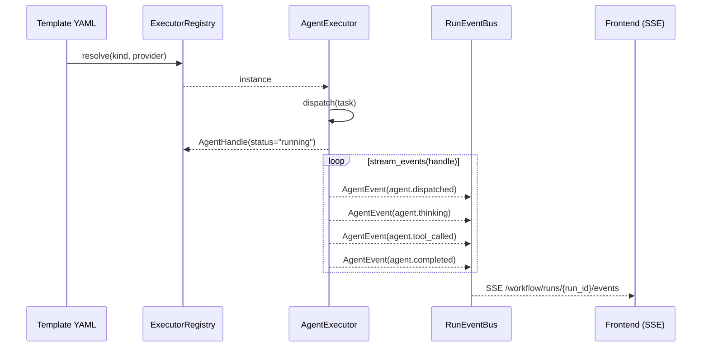

# Agent Plugin Contract

ShadowFlow 开放 agent 接入协议——任何人都可以把自己的 agent 接入 ShadowFlow 工作流编排平台。

---

## 1. 概述

ShadowFlow 是一个**异构 agent 编排平台**：不关心 agent 内部实现，只关心它遵守以下三条契约：

| 通道 | 方向 | 说明 |
|------|------|------|
| **Dispatch** | ShadowFlow → Agent | ShadowFlow 把任务（`AgentTask`）下发给 agent |
| **Report** | Agent → ShadowFlow | Agent 返回 `AgentHandle`（执行句柄），通过 `stream_events()` 上报结果 |
| **Observability** | Agent → ShadowFlow | 流式 `AgentEvent` 推送，通过 SSE endpoint 送到前端看板 |

支持四种接入通道（`kind`）：

```
api   — HTTP API 推理（OpenAI / Anthropic / 0G Compute）
cli   — CLI 子进程（Codex / Claude Code / OpenClaw / ShadowSoul）
mcp   — MCP tool 单次调用（标准 Model Context Protocol）
acp   — ACP session 管理（Agent Client Protocol，LSP-style stdio JSON-RPC）
```

---

## 2. AgentExecutor ABC 契约

### 2.1 三方法签名

所有 agent executor 必须继承 `AgentExecutor` 并实现以下三个方法。
ABC 本体定义在 `shadowflow/runtime/executors.py`；Pydantic 模型（`AgentTask` /
`AgentHandle` / `AgentCapabilities` / `AgentEvent`）定义在
`shadowflow/runtime/contracts.py`：

```python
from abc import ABC, abstractmethod
from typing import AsyncIterator

from shadowflow.runtime.contracts import (
    AgentTask,
    AgentHandle,
    AgentCapabilities,
    AgentEvent,
)

class AgentExecutor(ABC):
    kind: str     # "api" | "cli" | "mcp" | "acp"
    provider: str # e.g. "hermes", "openclaw", "shadowsoul"

    @abstractmethod
    async def dispatch(self, task: AgentTask) -> AgentHandle:
        """发送任务，返回执行句柄（不阻塞等完成）。"""

    @abstractmethod
    def stream_events(self, handle: AgentHandle) -> AsyncIterator[AgentEvent]:
        """返回一个 AsyncIterator[AgentEvent]；具体实现通常以 `async def` +
        `yield` 的 async generator 形式给出，ABC 本身只声明返回类型。
        迭代直到 agent.completed / agent.failed / agent.rejected。"""

    @abstractmethod
    def capabilities(self) -> AgentCapabilities:
        """声明 executor 支持的能力集。"""
```

### 2.2 核心 Pydantic 模型

#### AgentTask — 输入

| 字段 | 类型 | 说明 |
|------|------|------|
| `task_id` | `str` | 任务 ID（自动生成） |
| `run_id` | `str` | 所属 workflow run |
| `node_id` | `str` | 所属节点 |
| `agent_id` | `str` | agent 实例 ID |
| `payload` | `Dict` | 任务内容（`prompt` / `context` 等） |
| `metadata` | `Dict` | executor 配置（`server` / `tool` 等） |

#### AgentHandle — 执行句柄

| 字段 | 类型 | 说明 |
|------|------|------|
| `handle_id` | `str` | 句柄 ID（自动生成） |
| `run_id` | `str` | 同 task |
| `node_id` | `str` | 同 task |
| `agent_id` | `str` | 同 task |
| `status` | `Literal` | `pending` / `running` / `done` / `failed` / `degraded` |
| `metadata` | `Dict` | executor 私有状态（如 `_acp_client`、`_mcp_client`） |

#### AgentCapabilities — 能力申报

| 字段 | 类型 | 默认 | 说明 |
|------|------|------|------|
| `streaming` | `bool` | `False` | 是否支持流式事件 |
| `approval_required` | `bool` | `False` | 是否可触发 approval gate |
| `session_resume` | `bool` | `False` | 是否支持断点续传 |
| `tool_calls` | `bool` | `False` | 是否有工具调用能力 |

### 2.3 生命周期时序

ASCII 直观版：

```
Template YAML
    │
    ▼
ExecutorRegistry.resolve(kind, provider)
    │
    ▼
AgentExecutor.dispatch(task)
    │ ─── returns ──────────▶  AgentHandle(status="running")
    │
    ▼
AgentExecutor.stream_events(handle)
    │ ─── yields ──────────▶  AgentEvent(type="agent.dispatched")
    │ ─── yields ──────────▶  AgentEvent(type="agent.thinking")
    │ ─── yields ──────────▶  AgentEvent(type="agent.tool_called")
    │ ─── yields ──────────▶  AgentEvent(type="agent.completed")
    │
    ▼
RunEventBus.publish(run_id, event)
    │
    ▼
SSE /workflow/runs/{id}/events  ──▶  Frontend LiveDashboard
```

Mermaid 机读版（供 doc 生成器 / IDE 预览使用）：



---

## 3. 四种 Kind 语义与选用决策树

### 3.1 `api` — HTTP API 推理

直接调用 HTTP API，不启动子进程。适合 OpenAI / Anthropic / 0G Compute 等云端 provider。

```yaml
executor:
  kind: api
  provider: openai          # 或 anthropic
  model: gpt-4o
  api_key_env: OPENAI_API_KEY
```

### 3.2 `cli` — CLI 子进程

启动本地 binary，通过 stdin/stdout 通信。适合 Codex、Claude Code、OpenClaw、ShadowSoul 等有 CLI 接口的 agent。

```yaml
executor:
  kind: cli
  provider: openclaw        # 对应 provider_presets.yaml 中的 preset key
```

### 3.3 `mcp` — MCP tool 单次调用

通过 Model Context Protocol SDK 连接 MCP server，单次 `tools/call`。适合"查询某信息"类轻量调用，不需要 session 管理。

```yaml
executor:
  kind: mcp
  provider: hermes
  server: "stdio://hermes mcp serve"
  tool: run_agent
```

### 3.4 `acp` — ACP session 管理

通过 Agent Client Protocol（LSP-style stdio JSON-RPC）与 agent 保持完整 session。支持流式事件、审批流（`session.requestPermission`）、断点续传。

```yaml
executor:
  kind: acp
  provider: hermes
```

### 3.5 选用决策树

```
我的 agent 需要…
    │
    ├─ 维护多轮对话 session？
    │       └─ YES → acp
    │
    ├─ 单次工具调用（无 session）？
    │       └─ YES → mcp
    │
    ├─ 本地 binary / 子进程？
    │       └─ YES → cli
    │
    └─ 纯 HTTP API（云端）？
            └─ YES → api
```

---

## 4. 三通道契约

### 4.1 Dispatch 通道（ShadowFlow → Agent）

ShadowFlow 通过 `AgentExecutor.dispatch(task)` 把任务下发给 agent。

- `task.payload` 包含 `prompt`（字符串，workflow step 的指令）
- `task.metadata` 包含 executor-specific 配置（`server`、`tool`、`model` 等）
- `dispatch()` 必须**非阻塞**：立即返回 `AgentHandle`，不等 agent 完成

### 4.2 Report 通道（Agent → ShadowFlow）

ShadowFlow 通过 `AgentExecutor.stream_events(handle)` 读取 agent 结果。

- 生成器 yield `AgentEvent` 直到 `agent.completed` 或 `agent.failed`
- 每个 event 必须携带 `run_id` / `node_id` / `agent_id` 三字段
- executor 负责捕获 agent 崩溃并转换成 `agent.failed` event（不向上传播裸异常）

### 4.3 Observability 通道（Agent → ShadowFlow → Frontend）

`stream_events()` 产出的每个 `AgentEvent` 由 `RunEventBus.publish()` 推入队列，通过 SSE endpoint
`GET /workflow/runs/{run_id}/events` 实时送到前端 LiveDashboard。

Wire format：

```
id: 3
event: agent.tool_called
data: {"run_id":"r1","node_id":"n1","agent_id":"a1","type":"agent.tool_called","payload":{"tool":"search","args":{}}}

```

### 4.4 与 Edict 三通道对照

| ShadowFlow | Edict |
|---|---|
| Dispatch（`dispatch(task)`） | 任务下发（三省六部行文） |
| Report（`stream_events(handle)`） | 结果回传（奏章 / 批复） |
| Observability（SSE）| 通政司（实时观察） |

---

## 5. YAML 声明样板

### 5.1 Hermes（ACP 主通道）

```yaml
nodes:
  - id: research
    type: agent
    executor:
      kind: acp
      provider: hermes          # AcpAgentExecutor，command: hermes acp serve
    config:
      prompt: "Research {{topic}} and produce a summary."
```

### 5.2 OpenClaw（CLI + JSONL tail）

```yaml
nodes:
  - id: claw-worker
    type: agent
    executor:
      kind: cli
      provider: openclaw        # CliAgentExecutor，使用 provider_presets.yaml 中的 openclaw preset
    config:
      prompt: "Execute the following task: {{task}}"
```

### 5.3 ShadowSoul（ACP 或 CLI 双路径）

```yaml
# 路径 A：ACP（推荐，需要 shadow binary 支持 acp serve）
nodes:
  - id: soul
    type: agent
    executor:
      kind: acp
      provider: shadowsoul      # command: shadow acp serve

# 路径 B：CLI 兜底（shadow binary 不支持 ACP 时）
nodes:
  - id: soul
    type: agent
    executor:
      kind: cli
      provider: shadowsoul      # command: shadow run --id {id} --input {stdin}
```

如果 `shadow` binary 不在 PATH，ShadowFlow 自动返回 `agent.degraded` 事件，fallback 到 `api:claude`。

### 5.4 自定义 agent 从零接入（4 步）

**Step 1 — 在 `provider_presets.yaml` 添加 preset**

```yaml
my-agent:
  command: ["my-agent-cli"]
  args_template: ["run", "--id", "{id}", "--input", "{stdin}"]
  stdin_format: "json"          # "json" | "raw" | "none"
  parse_format: "jsonl-tail"    # "jsonl-tail" | "stdout-json" | "stdout-text"
  workspace_template: null
  env: {}
```

**Step 2 — 重启 ShadowFlow（或热重载）**

`CliAgentExecutor` 从 `provider_presets.yaml` 自动加载，无需改 Python 代码。

**Step 3 — 在模板 YAML 声明**

```yaml
executor:
  kind: cli
  provider: my-agent
```

**Step 4 — 验证**

```bash
# 健康检查
curl http://localhost:8000/health | jq .agents

# 跑一次 workflow
curl -X POST http://localhost:8000/workflow/run \
  -d '{"workflow": ..., "step_input": {"task": "hello"}}'
```

---

## 6. AgentEvent 命名空间

### 6.1 事件类型定义

定义在 `shadowflow/runtime/events.py` 的 `AgentEventType` 类：

| 常量 | 值 | 触发时机 |
|------|-----|---------|
| `DISPATCHED` | `agent.dispatched` | `dispatch()` 调用后，agent 开始执行 |
| `THINKING` | `agent.thinking` | agent 正在推理（流式中间状态） |
| `TOOL_CALLED` | `agent.tool_called` | agent 发起工具调用 |
| `TOOL_RESULT` | `agent.tool_result` | 工具调用返回结果 |
| `COMPLETED` | `agent.completed` | agent 成功完成，payload 含最终结果 |
| `FAILED` | `agent.failed` | agent 执行失败，payload 含 `code` / `detail` |
| `REJECTED` | `agent.rejected` | ACP `session.requestPermission` 被用户拒绝 |

附加事件（非核心 7 个，但也在命名空间内）：

| 常量 | 值 | 触发时机 |
|------|-----|---------|
| `OUTPUT` | `agent.output` | CLI stdout 文本输出 |
| `DEGRADED` | `agent.degraded` | Binary 缺失，降级到 fallback |
| `APPROVAL_REQUESTED` | `agent.approval_requested` | ACP `session.requestPermission` 触发审批 |

**规范事件集合**：`AgentEventType.ALL` 是 `frozenset[str]`，包含全部 10 个合法事件类型
（7 个核心 + 3 个附加）。消费者可以直接用它做白名单校验：

```python
from shadowflow.runtime.events import AgentEventType

assert event.type in AgentEventType.ALL
```

### 6.2 典型事件序列

**正常完成：**
```
agent.dispatched → agent.thinking+ → agent.tool_called → agent.tool_result → agent.completed
```

**执行失败：**
```
agent.dispatched → agent.thinking → agent.failed
```

**用户驳回：**
```
agent.dispatched → agent.approval_requested → agent.rejected
```

**Binary 缺失（降级）：**
```
agent.degraded  (fallback_chain: ["api:claude"])
```

### 6.3 SSE Wire Format

`data` 字段为 `AgentEvent.model_dump(mode="json", exclude_none=True)` 输出的 JSON 对象，
字段集合固定为：

| 字段 | 类型 | 说明 |
|------|------|------|
| `run_id` | `str` | 所属 workflow run |
| `node_id` | `str` | 所属节点 |
| `agent_id` | `str` | agent 实例 |
| `type` | `AgentEventType` | 事件类型字符串，属于 `AgentEventType.ALL` |
| `payload` | `dict` | 事件负载（结构视 `type` 而定） |
| `ts` | `str (ISO8601)` | 事件产生的 UTC 时间戳（服务端 `utc_now()`，消费者按 ISO8601 解析） |

```
id: {seq}
event: {AgentEvent.type}
data: {AgentEvent.model_dump(mode="json", exclude_none=True)}

```

例如：
```
id: 5
event: agent.completed
data: {"run_id":"r-abc","node_id":"n-writer","agent_id":"hermes-1","type":"agent.completed","payload":{"result":"done"},"ts":"2026-04-23T10:15:30Z"}

```

### 6.4 Last-Event-ID 重连语义

浏览器断线后自动重连：

```javascript
const es = new EventSource(`/workflow/runs/${runId}/events`);
// 浏览器自动在重连请求头中附加 Last-Event-ID: {last_seq}
// 服务端从 last_seq + 1 起重发，无丢失、无重复
```

`RunEventBus` 在内存中保存完整事件缓冲，重连后按 `last_seq` 快速 replay。

---

## 7. 如何写一个新的 provider preset

### 7.1 `provider_presets.yaml` 完整 Schema

```yaml
{provider-name}:
  command: list[str]           # 必选 — binary + 固定 flags
  args_template: list[str]     # 必选 — 追加的 args，支持插值：{id} {stdin} {run_id}
  stdin_format: str            # 必选 — "json" | "raw" | "none"
  parse_format: str            # 必选 — "stdout-json" | "stdout-text" | "jsonl-tail" | "codex-jsonl"
  workspace_template: str|null # 可选 — JSONL 尾追目录，如 "~/.myagent/{id}"
  env: dict[str, str]          # 可选 — 额外环境变量
```

**插值变量：**

| 变量 | 替换为 |
|------|--------|
| `{id}` | `task.agent_id` |
| `{run_id}` | `task.run_id` |
| `{stdin}` | stdin payload 内容（已序列化的字符串） |

### 7.2 注册流程

1. 在 `shadowflow/runtime/provider_presets.yaml` 添加 preset block
2. 重启 ShadowFlow（`preset_loader.load_presets()` 在启动时缓存）
3. `ExecutorRegistry.__init__()` 自动调用 `_build_preset_cli_executors()` 加载所有 preset
4. 模板 YAML 中写 `executor: {kind: cli, provider: <name>}` 即可

**无需修改任何 Python 代码。**

### 7.3 用户模板覆盖 preset 字段

在模板的 executor block 中可以覆盖 preset 的任意字段：

```yaml
executor:
  kind: cli
  provider: openclaw
  env:
    OPENCLAW_LOG_LEVEL: debug   # 覆盖 preset 中的 env
```

（注：当前 MVP 版本覆盖机制通过 `resolve_preset(provider, user_override)` 实现，见 `preset_loader.py`）

### 7.4 Worked Example — 接入 `foo-agent`

假设 `foo-agent` 是一个 CLI 工具，接受 JSON stdin，输出单行 JSON 结果：

```bash
echo '{"prompt":"hello"}' | foo-agent run --id my-session
# stdout: {"result":"hi there","status":"done"}
```

**Step 1** — 添加 preset：

```yaml
# shadowflow/runtime/provider_presets.yaml
foo-agent:
  command: ["foo-agent"]
  args_template: ["run", "--id", "{id}"]
  stdin_format: "json"
  parse_format: "stdout-json"
  workspace_template: null
  env: {}
```

**Step 2** — 模板声明：

```yaml
# my-workflow.yaml
nodes:
  - id: foo-worker
    type: agent
    executor:
      kind: cli
      provider: foo-agent
    config:
      prompt: "Summarize this document: {{document}}"
```

**Step 3** — 运行（响应中含 `run_id`，保留备用）：

```bash
curl -X POST http://localhost:8000/workflow/run \
  -H "Content-Type: application/json" \
  -d '{
    "workflow": {... paste my-workflow.yaml content as JSON ...},
    "step_input": {"document": "The quick brown fox..."}
  }'
# 响应: {"run_id": "r-abc123", ...}
```

**Step 4** — 观察事件流（把 Step 3 拿到的 `run_id` 替换进 URL）：

```bash
RUN_ID=r-abc123   # ← 用 Step 3 响应中的真实 run_id 替换
curl -N "http://localhost:8000/workflow/runs/${RUN_ID}/events"
# id: 0
# event: agent.dispatched
# data: {...}
#
# id: 1
# event: agent.completed
# data: {"payload":{"result":"The quick brown fox..."}}
```

---

## 8. 健康检查与降级

### 8.1 `/health` endpoint

```bash
curl http://localhost:8000/health | jq .agents
```

```json
{
  "shadowsoul": {"ok": false, "binary": "shadow", "error": "'shadow' not found in PATH"},
  "hermes":     {"ok": true,  "path": "/usr/local/bin/hermes", "version": "hermes 0.2.1"},
  "openclaw":   {"ok": false, "binary": "openclaw", "error": "'openclaw' not found in PATH"}
}
```

### 8.2 Binary 缺失时的降级机制

当 `CliAgentExecutor.dispatch()` 发现 binary 不在 PATH 时：

1. 返回 `AgentHandle(status="degraded")` 而非抛异常
2. `stream_events()` 立即 yield `AgentEvent(type="agent.degraded", payload={"fallback_chain": ["api:claude"]})`
3. 运行不中断——调用方可以检测 `degraded` 事件并切换到 fallback provider

这保证 Demo 在没有外部 binary 的环境中也能继续跑通。

---

## 9. 参考与交叉引用

- **9.1 [docs/HERMES_INTEGRATION_SPIKE.md](HERMES_INTEGRATION_SPIKE.md)**
  — Sprint 0 Hermes 实机验证（AR59 计划产物，*未建档，待 Sprint 0 补齐*）。
  该 SPIKE 的结论已由 Story 2.3（ACP client）+ Story 2.7（claw 命名 SPIKE）实际替代：
  见 §5.1 Hermes ACP YAML 样板 + §9.2。
- **9.2 [docs/HERMES_CLAW_SPIKE.md](HERMES_CLAW_SPIKE.md)** — Story 2.7：Hermes `claw` 子命令命名决议
- **9.3 [docs/SHADOWSOUL_RUNTIME_SPIKE.md](SHADOWSOUL_RUNTIME_SPIKE.md)** — Story 2.5：ShadowSoul ACP-first 接入决策
- **9.4 ACP spec**: https://github.com/zed-industries/agent-client-protocol — LSP-style stdio JSON-RPC
- **9.5 MCP Python SDK**: https://github.com/modelcontextprotocol/python-sdk — 官方 MCP 客户端

---

*文档基于 Story 2.1~2.7 实现，Epic 2 完成后更新。*
