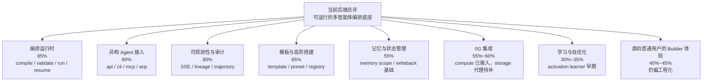
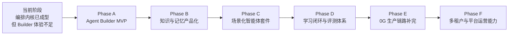
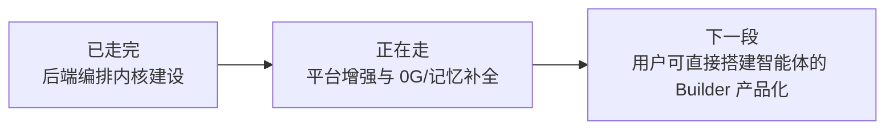

# ShadowFlow 后端成熟度评估与智能体搭建路线图

日期：2026-04-23
范围：后端能力、智能体搭建便利性、技术路线图
参考基线：
- `D:\VScode\TotalProject\hello-agents\docs\chapter11\第十一章 Agentic-RL.md`
- `D:\VScode\TotalProject\hello-agents\docs\chapter14\第十四章 自动化深度研究智能体.md`
- `D:\VScode\TotalProject\hello-agents\docs\chapter15\第十五章 构建赛博小镇.md`
- `D:\VScode\TotalProject\ShadowFlow\README.md`
- `D:\VScode\TotalProject\ShadowFlow\shadowflow\server.py`
- `D:\VScode\TotalProject\ShadowFlow\shadowflow\runtime\service.py`
- `D:\VScode\TotalProject\ShadowFlow\docs\AGENT_PLUGIN_CONTRACT.md`

## 1. 结论先行

### 1.1 当前后端完善度

按“能否支撑一个多智能体平台后端”来评估，ShadowFlow 当前后端完成度可估为：

- 后端基础设施成熟度：`70%~75%`
- 面向开发者的智能体接入能力：`75%~80%`
- 面向普通用户的低门槛搭建体验：`40%~50%`

一句话判断：

`ShadowFlow 已经具备可运行、可扩展、可验证的多智能体编排后端；但距离“让普通用户方便搭建智能体产品”还有一段明显的产品化与场景化距离。`

### 1.2 我们现在能方便用户搭建智能体吗

结论分两层：

- 对工程师用户：`基本可以，但偏底层。`
- 对普通业务用户：`还不够方便。`

原因不是后端太弱，而是当前更像“Agent Runtime + Contract + Plugin System”，还不是“Agent Builder 产品”。

## 2. 证据摘要

本次盘点看到的强信号：

- FastAPI 后端已提供约 `31` 条路由，覆盖 workflow 编译、校验、运行、恢复、SSE 事件流、chat session、template 导入、policy 热更新、轨迹导出与清洗等能力。
- 测试通过数为 `724 passed`，说明运行时内核、契约、SSE、模板、0G provider、插件协议等主链路已有较好稳定性。
- 已存在 `api / cli / mcp / acp` 四种 executor 通道，具备异构 agent 接入能力。
- 已有模板系统、registry/bundle、高阶 spec、内置 preset scaffold，说明“搭建智能体团队”的抽象层已经出现。
- 已有 0G Compute provider 与 0G Storage 归档接口雏形，且遵守了 0G 的关键契约约束。

本次盘点看到的弱信号：

- 用户新建 agent 的主路径仍以 YAML、preset、registry、executor 配置为主，偏工程接口，不是低代码产品体验。
- Agent API 文档已明确标记为 legacy，现阶段主入口更偏 runtime contract，而不是面向业务场景的 agent builder。
- 0G Storage 后端代理上传仍未实现，当前是前端 BYOK 直传优先。
- 自学习能力仍处于早期阶段，`assembly/learner.py` 还是 contextual bandit 级别，不是 chapter11 所描述的完整 Agentic RL 训练闭环。
- 缺少 chapter14/15 风格的场景化后端套件，例如开箱即用的深度研究 agent 包、NPC 记忆人格包、知识接入流水线、引用治理与长期状态管理产品层。

## 3. 与参考三章的能力对照

## 3.1 对照第 11 章 Agentic-RL

第 11 章强调六类能力：

- 推理
- 工具使用
- 记忆
- 规划
- 自我改进
- 感知

ShadowFlow 当前对应情况：

| 能力 | 当前状态 | 结论 |
| --- | --- | --- |
| 推理 | 依赖接入的外部 LLM/agent executor | 有入口，无平台级优化 |
| 工具使用 | `api/cli/mcp/acp` 多通道已具备 | 较强 |
| 记忆 | session/user/global/sqlite/redis 分层已有基础 | 有底座，缺场景化封装 |
| 规划 | workflow/stage/template/policy 已具备 | 较强 |
| 自我改进 | activation dataset + learner 已起步 | 早期 |
| 感知 | 未形成清晰多模态产品主线 | 偏弱 |

判断：

`ShadowFlow 对 Agentic-RL 的支撑更像“可学习编排底座”，还不是“训练型智能体平台”。`

## 3.2 对照第 14 章自动化深度研究智能体

第 14 章的核心后端要求是：

- 问题拆解
- 多轮信息采集
- 反思补搜
- 引用与来源追踪
- 流式反馈
- 最终结构化报告

ShadowFlow 当前已经具备的底座：

- 支持多节点工作流、阶段编排、SSE 流式事件
- 支持 artifact、checkpoint、trajectory、sanitization
- 支持 browser/tool 型能力接入
- 支持 template/preset 作为研究工作流骨架

ShadowFlow 当前仍缺少的产品层能力：

- 开箱即用的 Deep Research 工作流模板与后端服务封装
- 搜索结果去重、引用聚合、来源可信度评分
- TODO Planner / Summarizer / Report Writer 这类场景化 agent 套件
- “研究问题 -> 自动报告”的一键式用户路径

判断：

`做深度研究产品已经有后端地基，但还没搭成可直接卖给用户的房子。`

## 3.3 对照第 15 章构建赛博小镇

第 15 章强调：

- 角色化 agent
- 短期/长期记忆
- 状态管理
- 关系演化
- 实时日志
- 外部前端交互接口

ShadowFlow 当前已经具备：

- agent roster / group roster / template stage 等角色组织能力
- run/session/checkpoint/event bus 等运行状态能力
- memory 模块分层雏形
- SSE + API 适合作为外部前端宿主

ShadowFlow 当前不足：

- 记忆检索与人格建模还未产品化
- 缺少长期关系状态、实体状态、世界状态这类 game/NPC 级专用模型
- 没有第 15 章那样面向“持续角色交互”的业务封装

判断：

`更适合做“NPC 后台编排内核”，还不算“NPC 产品后端框架”。`

## 4. 当前能力分层判断

## 4.0 当前后端进展图

## 4.1 已经比较成熟的层

### A. 编排运行时

表现：

- workflow compile / validate / run / resume 主链路完整
- policy matrix、approval、reject、reconfigure、trajectory 等能力齐全
- 契约清晰，测试充分

评估：`85%`

### B. 异构 agent 接入层

表现：

- `api / cli / mcp / acp` 四通道具备
- provider preset 与 plugin contract 已成型
- 对外部 agent binary 缺失有 degrade/fallback 设计

评估：`80%`

### C. 可观测性与审计链路

表现：

- SSE event bus
- run graph / task tree / artifact lineage / checkpoint lineage
- trajectory sanitize / archive 接口

评估：`80%`

## 4.2 半成熟层

### D. 模板与高阶搭建层

表现：

- 已有 template、registry、preset scaffold
- 能帮助开发者搭建 agent team
- 但仍然偏 schema-first、infra-first

评估：`65%`

### E. 记忆与状态管理

表现：

- 有 memory 模块与 scope 抽象
- 但离业务型 agent 需要的知识注入、召回策略、冲突合并、长期偏好建模还有距离

评估：`55%`

### F. 0G 集成

表现：

- 0G Compute provider 已实现关键契约
- 0G Storage 后端代理仍未完成
- 更像接入能力，不是完整产品链路

评估：`55%~60%`

## 4.3 早期层

### G. 学习与自优化

表现：

- 已有 activation dataset 和 bandit learner
- 但尚未形成样本采集、离线评估、在线优化、策略回放的完整闭环

评估：`30%~35%`

### H. 面向普通用户的 agent builder 体验

表现：

- 缺少 wizard、知识导入、角色配置器、调试面板、部署发布流、模板市场
- 用户仍需理解 workflow、provider、executor、policy 等底层概念

评估：`40%~45%`

## 5. 为什么现在“还不算方便”

当前障碍主要不是算法，而是产品层缺口：

### 5.1 搭建入口过于工程化

用户创建一个 agent 仍然要接触：

- template YAML
- provider preset
- executor kind
- policy matrix
- runtime contract

这对开发者可接受，但对普通用户不够友好。

### 5.2 场景模版不足

和第 14、15 章相比，目前更偏通用底座，缺少明确的开箱场景包：

- 深度研究助手包
- 客服/销售/咨询 agent 包
- 长期记忆助手包
- NPC/角色扮演 agent 包
- 文档生产/审核/发布包

### 5.3 知识接入链路不完整

“让用户方便搭建智能体”通常离不开：

- 文档上传
- 切片索引
- 检索配置
- 引用回溯
- 版本更新

当前这些能力没有形成一条顺手的产品主路径。

### 5.4 缺少可运营能力

如果要真正给用户开放搭建，需要进一步具备：

- 用户/项目/工作区
- 权限与配额
- 发布与版本管理
- 运行监控与失败恢复界面
- 成本统计与 provider 选择建议

## 6. 技术路线图

目标：从“可运行的多智能体编排内核”走向“方便用户搭建智能体的平台后端”。

## 6.0 路线图总览图

## 6.0.1 路线图阶段目标图

```mermaid
flowchart TD
    A["Phase A<br/>让工程师更快搭 Agent"] --> A1["统一 Builder API"]
    A --> A2["模板实例化"]
    A --> A3["一键 Smoke Run"]

    B["Phase B<br/>让 Agent 真正可用"] --> B1["知识导入"]
    B --> B2["检索配置"]
    B --> B3["记忆写回与引用追踪"]

    C["Phase C<br/>让用户按场景搭建"] --> C1["Deep Research Kit"]
    C --> C2["Persona / NPC Kit"]
    C --> C3["Review / Publish Kit"]

    D["Phase D<br/>让系统可自我优化"] --> D1["反馈数据集"]
    D --> D2["评测基准"]
    D --> D3["Activation Learner V2"]

    E["Phase E<br/>让 0G 成为正式主线"] --> E1["Storage Proxy Upload"]
    E --> E2["Archive Flow"]
    E --> E3["余额 / 健康 / 归档可视化"]

    F["Phase F<br/>让平台可运营"] --> F1["用户/项目/工作区"]
    F --> F2["权限与配额"]
    F --> F3["版本与监控"]
```

## 6.0.2 当前后端进展技术路线图

说明：

- `已完成`：当前仓库已有稳定实现或明确测试覆盖
- `进行中`：已有实现雏形，但还没有成为完整产品链路
- `待启动`：路线图下一阶段重点建设项

```mermaid
flowchart LR
    subgraph P1["第一段：后端底座"]
        P1A["运行时契约<br/>已完成"]
        P1B["Workflow 编排执行<br/>已完成"]
        P1C["Checkpoint / Resume<br/>已完成"]
        P1D["SSE 事件流与可观测性<br/>已完成"]
    end

    subgraph P2["第二段：Agent 接入能力"]
        P2A["api / cli / mcp / acp 执行器<br/>已完成"]
        P2B["Provider Preset / Plugin Contract<br/>已完成"]
        P2C["Template / Registry / Preset Scaffold<br/>已完成"]
    end

    subgraph P3["第三段：平台增强"]
        P3A["Policy Matrix / Approval / Reject / Reconfigure<br/>已完成"]
        P3B["Lineage / Trajectory / Sanitize / Archive API<br/>已完成"]
        P3C["Memory Scope / Writeback 基础<br/>进行中"]
        P3D["0G Compute 接入<br/>进行中"]
        P3E["0G Storage 代理上传<br/>待启动"]
    end

    subgraph P4["第四段：面向用户的搭建能力"]
        P4A["Agent Builder API<br/>待启动"]
        P4B["Knowledge Pack / Retrieval<br/>待启动"]
        P4C["Deep Research / NPC / Review 套件<br/>待启动"]
        P4D["评测与学习闭环<br/>待启动"]
        P4E["多租户与运营能力<br/>待启动"]
    end

    P1 --> P2 --> P3 --> P4
```

## 6.0.3 当前阶段一句话定位图

## 6.1 Phase A：Agent Builder MVP

周期建议：`2~3 周`

目标：

- 让技术用户不写太多 YAML 也能搭一个 agent team

优先事项：

- 增加“创建 agent/团队模板”的后端向导接口
- 将 provider preset、agent spec、template spec 做成统一创建 API
- 提供模板参数化实例化接口
- 提供一键 smoke run 与失败原因诊断

交付物：

- `POST /builder/agents`
- `POST /builder/templates`
- `POST /builder/instantiate`
- `POST /builder/smoke-run`
- 一个最小的“深度研究 / 内容生产 / 代码协作”三套模板

成功标准：

- 一个工程师在 10 分钟内能创建并运行自己的第一个 agent workflow

## 6.2 Phase B：知识与记忆产品化

周期建议：`3~5 周`

目标：

- 补齐 chapter14、15 需要的“知识密集型”和“长期状态型”能力

优先事项：

- 文档导入、切片、索引、检索配置
- session/user/global memory 的统一读写接口
- artifact 到 memory 的自动写回策略
- 引用与来源追踪标准化
- 用户可配置的记忆保留/淘汰策略

交付物：

- Knowledge Pack API
- Retrieval Profile API
- Memory Writeback Policy API
- 引用追踪与来源评分

成功标准：

- 用户能给 agent 绑定一组知识源，并在运行结果中看到可回溯引用

## 6.3 Phase C：场景化智能体套件

周期建议：`3~4 周`

目标：

- 把底座封装成用户可理解的产品能力

优先事项：

- Deep Research Kit
- NPC / Persona Kit
- Customer Success Kit
- Review / Approve / Publish Kit

每个套件至少包含：

- 推荐模板
- 推荐角色
- 默认 policy
- 默认记忆策略
- 默认可观测指标

成功标准：

- 用户从业务目标出发，而不是从 executor/preset 出发创建 agent

## 6.4 Phase D：学习闭环与评测体系

周期建议：`4~6 周`

目标：

- 把 chapter11 的“自我改进”从研究点推进到工程闭环

优先事项：

- 统一收集 run feedback / reward hints / human approval data
- 增加评测任务集与回放基准
- 从 contextual bandit 升级到更强的策略学习
- 将 activation learner 接入真实模板推荐与工作流优化

交付物：

- Eval Harness
- Feedback Dataset Export
- Policy Recommendation Service
- Activation Learner V2

成功标准：

- 新版本 agent/template 的效果提升可以被量化，而不是靠感觉

## 6.5 Phase E：0G 生产链路补完

周期建议：`2~4 周`

目标：

- 让 0G 不只是“能接”，而是“可作为卖点”

优先事项：

- 完成后端 trajectory proxy upload
- 补齐 provider discovery / account management / archive flow
- 暴露 compute/storage 健康、余额、失败原因
- 将 0G 归档纳入正式工作流结果对象

成功标准：

- 用户在一个完整工作流中可直接获得：运行结果、轨迹归档、可验证引用

## 6.6 Phase F：多租户与平台运营能力

周期建议：`4~6 周`

目标：

- 从“单机开发工具”升级为“可服务用户的平台”

优先事项：

- user/project/workspace
- auth/rbac
- quota/billing hooks
- agent/app versioning
- dashboard 与告警

成功标准：

- 多个用户和多个 agent 项目可同时稳定运行并被治理

## 7. 建议的近期优先级

如果只做最关键的 3 件事，我建议：

### P0

- 做 `Agent Builder MVP`
- 做 `Knowledge Pack + Retrieval`
- 做 `场景化模板包`

原因：

这三项决定“用户是否感觉方便”。

### P1

- 做 `0G 正式归档链路`
- 做 `评测与反馈闭环`

原因：

这两项决定“平台是否有差异化护城河”。

### P2

- 做 `多租户、权限、配额、运营能力`

原因：

这是从项目到平台的放大器，但不是当前最先阻塞“用户能不能搭”的点。

## 8. 建议的对外表述

当前最准确的定位不是：

`ShadowFlow 已经是低代码智能体搭建平台。`

而更接近：

`ShadowFlow 已经完成多智能体编排后端的核心底座，正在从工程框架演进为面向用户的智能体搭建平台。`

## 9. 最终判断

### 9.1 如果问题是“后端现在做得怎么样”

回答：

`后端核心已经达到可用且比较扎实的阶段，尤其是编排、契约、事件流、插件接入和测试稳定性。`

### 9.2 如果问题是“现在能否方便用户搭建智能体”

回答：

- 对开发者：`可以开始试用并搭建。`
- 对普通用户：`还需要补一层 Builder、Knowledge、Template、运营能力。`

### 9.3 如果问题是“下一阶段最该做什么”

回答：

`不要继续只堆底层能力，应该尽快把现有后端包装成可被用户感知的搭建路径。`
