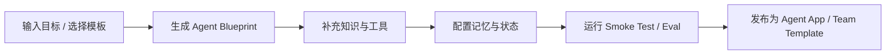
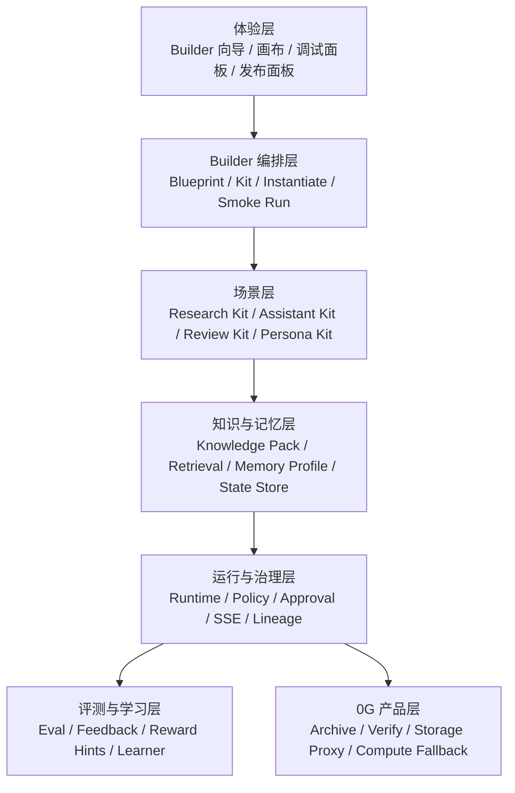
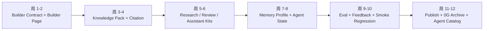

# ShadowFlow 用户搭建智能体路线图

日期：2026-04-23
范围：用户如何更方便地搭建智能体、对应产品与技术路线
作者视角：基于 ShadowFlow 当前代码基线，结合 Hello-Agents 第 11 / 14 / 15 章的启发进行反推
参考资料：
- `D:\VScode\TotalProject\hello-agents\docs\chapter5\第五章 基于低代码平台的智能体搭建.md`
- `D:\VScode\TotalProject\hello-agents\docs\chapter6\第六章 框架开发实践.md`
- `D:\VScode\TotalProject\hello-agents\docs\chapter7\第七章 SimpleAgent 与工具系统.md`
- `D:\VScode\TotalProject\hello-agents\docs\chapter13\第十三章 智能旅行助手.md`
- `D:\VScode\TotalProject\hello-agents\docs\chapter11\第十一章 Agentic-RL.md`
- `D:\VScode\TotalProject\hello-agents\docs\chapter14\第十四章 自动化深度研究智能体.md`
- `D:\VScode\TotalProject\hello-agents\docs\chapter15\第十五章 构建赛博小镇.md`
- `D:\VScode\TotalProject\ShadowFlow\README.md`
- `D:\VScode\TotalProject\ShadowFlow\docs\AGENT_PLUGIN_CONTRACT.md`
- `D:\VScode\TotalProject\ShadowFlow\docs\plans\shadowflow-backend-agent-roadmap-2026-04-23.md`
- `D:\VScode\TotalProject\ShadowFlow\src\TemplatesPage.tsx`
- `D:\VScode\TotalProject\ShadowFlow\src\EditorPage.tsx`
- `D:\VScode\TotalProject\ShadowFlow\src\templates\presets.ts`
- `D:\VScode\TotalProject\ShadowFlow\src\core\components\Canvas\WorkflowCanvas.tsx`
- `D:\VScode\TotalProject\ShadowFlow\docs\tutorials\getting-started\your-first-workflow.md`

---

## 1. 结论先行

如果目标是“让用户方便搭建智能体”，ShadowFlow 现在最该做的，不是继续加更多底层 executor，也不是直接跳去做完整 Agentic RL，而是把现有运行时能力包装成一条 `目标驱动、场景优先、带知识和验证闭环` 的 Builder 主路径。

一句话判断：

`我们应该把 ShadowFlow 从 workflow editor，推进成 agent builder。`

这条路的正确顺序应该是：

1. 先解决 `怎么创建`
2. 再解决 `怎么接知识`
3. 然后解决 `怎么按场景复用`
4. 再补 `怎么长期记忆与持续状态`
5. 最后才是 `怎么评测、自优化、学习闭环`

换句话说：

`第 14 章告诉我们先把“规划-执行-报告”做成产品路径，第 15 章告诉我们要把记忆/人格/状态做成可配置层，第 11 章告诉我们自我优化必须做，但不该成为第一阶段。`

---

## 2. 三章给我们的直接启发

## 2.1 第 14 章的启发：用户要的是任务闭环，不是节点集合

自动化深度研究智能体的成功关键，不是“有三个 Agent”，而是它给了用户一条非常自然的路径：

- 输入研究主题
- 自动拆成 TODO
- 搜索和总结
- 生成报告
- 全程可追踪、可流式看到进度

这说明对普通用户来说，最佳入口不是：

- 先创建 node
- 再配 provider
- 再接 policy
- 再拼 workflow

而应该是：

- 先说目标
- 系统自动给出智能体骨架
- 用户只需要补充知识、风格、工具边界和验收标准

结论：

`Builder 必须是 intent-first（目标优先），不能只是 graph-first（画布优先）。`

## 2.2 第 15 章的启发：真正可用的智能体，不只是一次性工作流

赛博小镇最关键的不是 UI，而是三个后端特征：

- 角色设定
- 短期/长期记忆
- 持续状态与关系演化

这意味着 ShadowFlow 不能只支持“一次 run”，还要支持：

- 这个 agent 是谁
- 它知道什么
- 它记住什么
- 它如何随着交互变化

结论：

`我们需要把 agent 从“执行节点”提升为“带角色、记忆、状态的可发布单元”。`

## 2.3 第 11 章的启发：学习闭环要后置，但埋点必须前置

第 11 章讲得很清楚，Agentic RL 真正优化的是：

- 推理
- 工具使用
- 记忆管理
- 规划
- 自我改进

但这类能力的前提是有稳定的数据闭环：

- 任务输入
- 轨迹
- 反馈
- 奖励提示
- 离线评测

所以现在不应该直接上复杂训练平台，而应该先做：

- run feedback 采集
- approval / reject 记录
- 引用质量、任务成功率、重试率指标
- 模板级评测集

结论：

`先做可评测，再做可学习。`

## 2.4 第 13 章的启发：先把 Agent 变成完整应用，再谈底层抽象

第 13 章智能旅行助手的关键，不是它用了多少 Agent，而是它已经给出了完整的用户产品闭环：

- 用户填写目标和偏好
- 后端调用多个专门 Agent
- 前端展示结果、地图、预算、编辑、导出

这对 ShadowFlow 很重要，因为它提醒我们：

`用户感知的不是“我用了四个 Agent”，而是“我获得了一个可以直接完成任务的助手”。`

也就是说，面向用户的 Builder 不应该只让用户创建“agent graph”，还要让用户感受到：

- 这个团队能做什么
- 最终会产出什么
- 结果如何被查看、编辑、导出、继续协作

结论：

`Builder 的目标不是让用户完成建模，而是让用户更快到达第一个可用应用。`

## 2.5 第 5-7 章给出的额外启发：用户搭建其实是一个梯度，不是一种入口

如果把 `hello-agents` 放在一起看，它其实给了一条很清晰的递进路径：

- `chapter5`：低代码/零代码入口
- `chapter7`：安装即用、再逐步深入的框架入口
- `chapter13-15`：成品化、场景化、可直接使用的产品入口

这很值得 ShadowFlow 借鉴，因为它说明：

`真正方便用户搭建智能体，不是所有人都走同一条入口，而是给不同成熟度用户不同的起点。`

对 ShadowFlow 来说，建议明确保留三种入口：

1. `Template-first`
2. `Conversation-first`
3. `Graph-first`

其中：

### Template-first

适合：

- 想先跑起来的用户
- 愿意 fork 现成团队的用户

### Conversation-first

适合：

- 不想先看节点图的用户
- 更习惯“我说目标，你帮我长出团队”的用户

### Graph-first

适合：

- 高级用户
- 需要显式控制协作结构和策略的工程用户

## 2.6 第 6 章的补充：不是所有产品都该追求同一种“智能体协作”

第 6 章有一个对 ShadowFlow 很关键的判断框架：

- 有些场景更适合 `涌现式协作`
- 有些场景更适合 `显式控制 / 工程化编排`

这意味着 ShadowFlow 不应该试图把所有面向用户的产品都做成同一个样子。

建议明确分成两条产品线：

1. `Conversation-first 产品线`
2. `Control-first 产品线`

### Conversation-first 产品线

适合：

- 助手
- 研究
- 陪伴
- 角色互动

这里应该强调：

- 群聊
- 单聊
- 场景
- 记忆
- 渐进式暴露复杂度

### Control-first 产品线

适合：

- 审批链
- 发布流
- 多角色协同写作
- 高可追溯工作流

这里应该强调：

- Policy Matrix
- Checkpoint
- Graph
- Eval
- Publish

这两条都属于“智能体搭建”，只是默认入口不同。

---

## 3. 我们现在的问题，不是“没有能力”，而是“没有主路径”

结合当前仓库，ShadowFlow 已经有很强的底座：

- 后端运行时：`shadowflow/runtime/`
- 编排与组装：`shadowflow/assembly/`
- 记忆基础：`shadowflow/memory/`
- API 服务：`shadowflow/api/`、`shadowflow/server.py`
- 前端编辑器与运行面板：`src/core/`、`src/pages/`
- 模板与预设：`src/templates/`、`shadowflow/runtime/provider_presets.yaml`

但用户搭建智能体仍然要面对底层概念：

- provider
- executor kind
- template
- policy matrix
- memory scope
- workflow schema

这对工程师还能接受，对普通用户不够友好。

真正的缺口有四个：

1. 缺少 `Builder 向导层`
2. 缺少 `知识接入主路径`
3. 缺少 `场景化 Agent Kit`
4. 缺少 `评测与反馈面板`

## 3.1 先回答一个关键误解：我们现在当然已经在做“智能体搭建”

这个问题需要说清楚。

如果按照能力定义，ShadowFlow 当前已经具备多项“智能体搭建”能力：

- 模板库：帮助用户从现成 agent team 出发
- 画布编辑器：允许用户拖拽节点、连接协作关系
- 群聊 / 单聊 / BriefBoard / Inbox 设想：在产品概念上已经把 agent 当作团队成员来组织
- Policy Matrix：让多 Agent 协作不是散乱对话，而是可治理工作流
- Provider / Plugin Contract：允许接入外部 agent，扩展团队能力

所以更准确的判断不是：

`ShadowFlow 还没有智能体搭建能力。`

而是：

`ShadowFlow 已经有智能体搭建能力，但当前更像“面向懂系统的人搭建智能体团队”，还没有完全收敛成“普通用户一眼就能上手的搭建产品”。`

这两句话差别很大。

前者是否定现状，后者是在承认你已经做对了一半的基础上，指出下一段应该补哪一层。

## 3.2 为什么模板、群聊、单聊“算搭建”，但仍会让人感觉偏工程

这是本次讨论的核心。

### 第一层：它们为什么算“搭建”

从产品语义上看：

- `模板` 解决的是“如何快速得到一个初始团队”
- `群聊` 解决的是“多个 agent 如何围绕共同目标协作”
- `单聊` 解决的是“用户如何对某个 agent 单独调教和委派”
- `工作流画布` 解决的是“agent 之间的结构、控制流和治理规则”

这四者拼起来，本质上就是智能体搭建。

也就是说，你的直觉是对的：

`模板 + 群聊 + 单聊 + 画布，本来就是 Agent Builder 的骨架。`

### 第二层：为什么用户仍会感觉偏工程

因为当前主路径还是更接近：

- 先理解 schema
- 先理解 node type
- 先理解 provider / policy / edge
- 再拼一个团队

而不是：

- 我想做一个研究助手
- 我想做一个公司里的市场同事
- 我想做一个能记住上下文的长期角色
- 系统帮我先长出来一个骨架

当前有三个很具体的信号说明它还偏工程：

#### 信号 1：教程主入口仍然是 workflow schema

当前 getting started 教程 [`your-first-workflow.md`](/D:/VScode/TotalProject/ShadowFlow/docs/tutorials/getting-started/your-first-workflow.md) 的起点是：

- 创建 YAML
- 校验 workflow
- 运行 workflow

这条路径对工程师是清晰的，但对普通用户不是“创建智能体”，而是“编写可执行流程”。

#### 信号 2：模板页虽然很像产品，但模板仍主要在表达结构

当前模板页与预设 [`TemplatesPage.tsx`](/D:/VScode/TotalProject/ShadowFlow/src/TemplatesPage.tsx)、[`presets.ts`](/D:/VScode/TotalProject/ShadowFlow/src/templates/presets.ts) 已经很接近用户产品：

- 有精选模板
- 有 seed team
- 有一键 fork
- 有 graph preview

但模板描述仍然主要围绕：

- 多少 agents
- 多少 edges
- 用什么 services
- retry depth

这说明它已经在做“团队搭建”，但表达重心仍偏运行结构，不够偏用户任务。

#### 信号 3：编辑器入口仍以节点与控制流为中心

当前编辑器和画布 [`EditorPage.tsx`](/D:/VScode/TotalProject/ShadowFlow/src/EditorPage.tsx)、[`WorkflowCanvas.tsx`](/D:/VScode/TotalProject/ShadowFlow/src/core/components/Canvas/WorkflowCanvas.tsx) 的默认操作是：

- 从左侧 palette 拖节点
- 连线
- 设置 gate
- 运行

这非常适合“系统编排者”，但不等于“业务用户正在创建一个助手”。

所以真正的问题不是“我们是不是在搭建智能体”。

真正的问题是：

`我们现在主要是在让用户搭建结构，而不是先让用户搭建角色、目标和场景。`

## 3.3 更准确的产品分层说法

为了避免后续讨论继续打架，建议统一用下面这组术语：

| 层级 | 当前 ShadowFlow 已有 | 用户感知 |
| --- | --- | --- |
| `结构层搭建` | 模板、节点、边、Policy Matrix、Provider | 已经很强 |
| `团队层搭建` | seed team、公司/部门隐喻、群聊/单聊/BriefBoard 概念 | 已经出现 |
| `用户层搭建` | 目标输入、知识导入、角色配置、验证与发布主路径 | 仍然不足 |

这样我们以后就不用再用“算不算搭建”这种容易误解的说法。

更精确的结论应该是：

`ShadowFlow 已经完成了结构层和部分团队层搭建，下一步要补的是用户层搭建。`

## 3.4 真正的断层：Quad-View 还没有产品化成主路径

从现有设计文档和类型约定看，ShadowFlow 的产品理想其实很清晰：

- `Inbox`
- `Chat`
- `AgentDM`
- `BriefBoard`
- `Canvas`

这里面已经隐含了一个非常好的用户分层：

- `Chat` 负责和整个团队协作
- `AgentDM` 负责和单个角色对齐
- `BriefBoard` 负责看长期状态和记忆沉淀
- `Canvas` 负责结构精修

问题在于，这条链路目前还没有被做成统一、连续、渐进暴露复杂度的主入口。

当前用户更容易经历的是：

`模板 -> 编辑器 -> 节点/边/策略/YAML`

而不是：

`目标 -> 团队群聊 -> 单聊细化 -> 日报/状态 -> 需要时再下钻到画布`

这就是为什么你会觉得“我们明明已经有模板、群聊、单聊，为什么还会被说偏工程”。

因为产品心智其实已经出现了，但默认入口还没有真正站到它那一边。

所以建议把下一步的关键任务明确定义为：

`把 Quad-View 从概念与分散能力，收束成 task-first、conversation-first、progressive disclosure 的 Builder 主路径。`

---

## 4. 我们要达成的目标形态

## 4.1 用户视角下的目标体验

理想状态下，用户创建一个智能体应该只需要 6 步：

1. 选择目标或模板
2. 选择角色和协作模式
3. 上传知识或连接数据源
4. 选择工具权限和安全边界
5. 运行 smoke test
6. 发布为可复用的 agent app

也就是：

## 4.2 平台视角下的目标形态

ShadowFlow 最终应该分成六层：

## 4.3 借鉴 Godot：把 Agent Builder 做成“场景编辑器”

第 15 章里 Godot 的思路很值得借：

- 节点是最小构件
- 场景是可复用组合
- Inspector 修改单个节点属性
- 脚本定义行为
- 信号连接对象之间的交互

这套思路和 ShadowFlow 天然兼容。

如果把它翻译到智能体搭建领域，可以得到下面这个映射：

| Godot 概念 | ShadowFlow 对应 |
| --- | --- |
| `Node` | 单个 Agent / Tool / Gate / Memory Hook |
| `Scene` | 一个可复用的智能体团队或工作流模板 |
| `Inspector` | 角色、工具权限、知识包、记忆配置面板 |
| `Script` | Prompt / Policy / Runtime config / Handoff rules |
| `Signal` | agent 间 handoff、事件、审批、回调 |
| `Scene Tree` | team hierarchy / workflow outline |

这意味着我们不一定要把 Builder 理解成“低代码表单”。

我们完全可以把它理解成：

`一个面向智能体的场景编辑器。`

这个方向的好处很大：

1. 用户容易理解：拖节点、选角色、连关系，本身就符合直觉
2. 与现有 ReactFlow 资产兼容：不需要推翻当前画布
3. 模板天然就能升级为 Scene
4. 群聊 / 单聊 / BriefBoard 可以作为 Scene 的运行视图，而不是割裂的别处功能

## 4.4 建议的 Godot 式交互模型

如果按“场景编辑器”来重构 Builder，建议做三种视图模式：

1. `Goal Mode`
2. `Scene Mode`
3. `Graph Mode`

### Goal Mode

给普通用户。

用户输入：

- 我想做什么
- 给谁用
- 需要哪些知识
- 需要几个角色

系统输出一个初始 Scene。

### Scene Mode

给大多数用户。

像 Godot 的场景编辑一样编辑：

- 左侧 Scene Tree
- 中间可视画布
- 右侧 Inspector

用户在这里处理：

- 角色命名
- 团队结构
- 工具权限
- 知识包绑定
- 记忆策略

### Graph Mode

给高级用户和工程师。

继续保留现在的 workflow / edge / gate 级精修能力。

这样不会丢掉你现有的强项，还能把复杂度分层隐藏。

## 4.5 最小可行的 Agent Scene Editor

如果只做 MVP，建议先包含 5 个区域：

1. `Scene Tree`
2. `Canvas`
3. `Inspector`
4. `Knowledge Dock`
5. `Run Preview`

其中：

### Scene Tree

展示：

- Team
- Agents
- Shared tools
- Shared memory

### Canvas

展示：

- Agent 节点
- Tool 节点
- Handoff / Approval / Parallel 连接

### Inspector

编辑：

- 角色描述
- prompt
- tool policy
- handoff rule
- memory profile

### Knowledge Dock

绑定：

- 文档
- 知识包
- 检索策略
- 引用开关

### Run Preview

展示：

- 对话预演
- 任务执行预演
- smoke test 结果

这 5 个区域比“纯 YAML”更接近 Godot 的心智模型，也更接近用户口中的“创建智能体”。

---

## 5. 先定义清楚我们要新增的核心对象

如果没有新的 Builder 级对象，后面所有功能都会继续陷在 workflow schema 里。

建议新增 6 个一等公民对象。

## 5.1 AgentBlueprint

作用：

- Builder 的核心中间产物
- 把“用户目标”翻译成“可实例化的智能体配置”

建议字段：

- `id`
- `name`
- `goal`
- `mode`：single-agent / team / research / reviewer / persona
- `roles`
- `knowledge_packs`
- `tool_policies`
- `memory_profile`
- `eval_profile`
- `publish_profile`

建议落点：

- 后端：`shadowflow/runtime/contracts_builder.py`
- 前端类型：`src/common/types/agent-builder.ts`

## 5.2 RoleProfile

作用：

- 定义角色职责、语气、输入输出边界
- 吸收第 15 章的人格和角色设定经验

建议字段：

- `role_id`
- `title`
- `system_prompt`
- `capabilities`
- `handoff_rules`
- `persona_traits`
- `state_fields`

## 5.3 KnowledgePack

作用：

- 定义一个 agent 可以访问的知识集合
- 吸收第 14 章的研究资料组织方式

建议字段：

- `pack_id`
- `name`
- `sources`
- `chunking_strategy`
- `retrieval_profile`
- `citation_required`
- `freshness_policy`

## 5.4 MemoryProfile

作用：

- 定义记忆保留、检索和写回规则
- 吸收第 15 章的短期/长期记忆经验

建议字段：

- `working_memory_limit`
- `episodic_retention_days`
- `semantic_retrieval_top_k`
- `writeback_policy`
- `state_sync_policy`

## 5.5 ToolPolicy

作用：

- 定义工具可见性、权限和审批边界

建议字段：

- `tool_name`
- `visibility`
- `approval_required`
- `max_budget`
- `allowed_domains`
- `safety_level`

## 5.6 EvalProfile

作用：

- 给每个 agent 一个最低可验证标准
- 吸收第 11 章的“先评测再学习”

建议字段：

- `success_metrics`
- `test_prompts`
- `golden_outputs`
- `citation_checks`
- `failure_thresholds`

---

## 6. 第一阶段真正该做什么

## 6.1 核心原则

现在最重要的不是“把所有高级能力一次做全”，而是遵守以下原则：

1. `从目标生成，而不是从空白画布开始`
2. `从模板实例化，而不是让用户先学 schema`
3. `从 smoke run 开始，而不是先相信配置正确`
4. `从引用、日志、反馈入手，而不是先上训练`
5. `从场景 kit 提供价值，而不是只暴露底层组件`

## 6.2 第一阶段北极星指标

建议把第一阶段目标定义为：

- 工程师用户：`10 分钟内创建并跑通第一个 Agent`
- 非工程用户：`30 分钟内通过模板产出一个可用结果`
- Builder 首次成功率：`>= 70%`
- Smoke run 通过率：`>= 80%`

---

## 7. 详细技术路线图

## 7.1 Phase A：Agent Builder MVP

目标：

`让用户从“目标”出发，而不是从“工作流 schema”出发。`

周期建议：`2~3 周`

### 产品交付

- 新增 `Builder` 入口页
- 支持“通过目标创建 agent”
- 支持“通过模板创建 agent”
- 支持一键 smoke run
- 支持把结果回填成 workflow 与 template
- 支持 `Goal / Scene / Graph` 三种编辑模式切换

### 后端工作

建议新增：

- `shadowflow/api/builder.py`
- `shadowflow/runtime/builder_service.py`
- `shadowflow/runtime/contracts_builder.py`

建议 API：

- `POST /builder/blueprints/generate`
- `POST /builder/blueprints/instantiate`
- `POST /builder/smoke-run`
- `GET /builder/kits`

### 前端工作

建议新增：

- `src/pages/BuilderPage.tsx`
- `src/core/components/builder/`
- `src/core/components/scene-tree/`
- `src/core/components/inspector/agent-inspector/`
- `src/core/components/knowledge-dock/`
- `src/api/builder.ts`
- `src/common/types/agent-builder.ts`

建议 UI 分 4 步：

1. 目标输入
2. 模板建议
3. 知识与工具配置
4. 验证与发布

并在 Builder 内部保留 3 个层次的入口：

1. `Goal`
2. `Scene`
3. `Graph`

### 验收标准

- 用户不需要直接编辑 YAML 也能创建可运行流程
- 生成结果可回退到现有 editor 继续精修
- smoke run 能给出明确失败原因
- 普通用户默认停留在 `Goal / Scene` 两层，不必先看到 edge condition

---

## 7.2 Phase B：知识接入与引用闭环

目标：

`让用户的 agent 真的有“知道什么”的能力。`

周期建议：`3~4 周`

### 为什么这阶段必须紧跟在 Builder 后面

因为用户一旦能创建 agent，马上就会问三个问题：

- 它能读我的文档吗
- 它能基于我的知识回答吗
- 它回答时能不能标出处

这正是第 14 章最核心的产品价值。

### 产品交付

- 文档上传与知识包创建
- Retrieval Profile 配置
- 结果中的引用追踪
- 来源去重与可信度评分

### 后端工作

建议新增：

- `shadowflow/api/knowledge.py`
- `shadowflow/memory/knowledge_pack.py`
- `shadowflow/memory/retrieval_profiles.py`
- `shadowflow/runtime/citation_service.py`

建议 API：

- `POST /knowledge/packs`
- `POST /knowledge/packs/{id}/ingest`
- `POST /knowledge/packs/{id}/query`
- `GET /knowledge/packs/{id}/sources`

### 前端工作

建议新增：

- `src/pages/KnowledgePage.tsx`
- `src/core/components/knowledge/`
- `src/common/types/knowledge.ts`

### 验收标准

- 用户可为 agent 绑定至少一个 Knowledge Pack
- 运行结果中能看到来源引用
- 深度研究类模板可直接输出“带引用报告”

---

## 7.3 Phase C：场景化 Agent Kit

目标：

`把底层能力封装成用户听得懂、拿来就能用的产品能力。`

周期建议：`3~4 周`

### 为什么这一步是核心拐点

真正“方便用户搭建智能体”的关键，不是 Builder 本身，而是 Builder 里有什么可选内容。

如果没有场景 kit，Builder 只是一个更好看的配置器。

### 第一批建议做的 Kit

1. `Research Kit`
2. `Knowledge Assistant Kit`
3. `Review & Approval Kit`
4. `Persona / NPC Kit`

### 各 Kit 的定义

#### Research Kit

来源：第 14 章

包含：

- Planner
- Search / Gather
- Summarizer
- Report Writer
- 引用策略
- 流式进度模板

#### Knowledge Assistant Kit

来源：第 14 章 + 当前 ShadowFlow 契约能力

包含：

- FAQ 回答
- 文档检索
- 引用回复
- 失败转人工

#### Review & Approval Kit

来源：ShadowFlow 现有 Policy Matrix 强项

包含：

- Writer
- Reviewer
- Approver
- Reject / rerun 闭环

#### Persona / NPC Kit

来源：第 15 章

包含：

- RoleProfile
- MemoryProfile
- State fields
- Relationship hooks

### 代码落点建议

- `shadowflow/runtime/kits/`
- `src/templates/kits/`
- `src/core/components/builder/kits/`

### 验收标准

- 用户不理解 runtime 细节，也能基于 kit 创建 agent
- 每个 kit 都有默认模板、默认 policy、默认 eval

---

## 7.4 Phase D：状态、记忆与持续 Agent

目标：

`让 agent 从“一次性执行器”升级为“持续交互对象”。`

周期建议：`4~5 周`

### 这一步解决什么问题

第 15 章已经说明，仅靠 prompt 不足以支撑长期交互。要让 agent 更像团队成员或角色，需要：

- working memory
- episodic memory
- user-specific memory
- 状态字段
- 关系字段

### 产品交付

- Memory Profile UI
- Agent State 面板
- 对话/运行后的自动写回
- 状态快照与恢复

### 后端工作

优先扩展现有模块：

- `shadowflow/memory/session.py`
- `shadowflow/memory/user.py`
- `shadowflow/memory/global_memory.py`
- `shadowflow/core/agent_state.py`

建议新增：

- `shadowflow/api/state.py`
- `shadowflow/runtime/state_service.py`

### 前端工作

建议新增：

- `src/core/components/agent-state/`
- `src/common/types/agent-state.ts`

### 验收标准

- agent 可以保留用户偏好和最近任务上下文
- Persona/NPC kit 能表现出连续性
- 用户能查看与清理记忆

---

## 7.5 Phase E：评测、反馈与自优化闭环

目标：

`先让每个 agent 都可测，再让系统具备温和的自优化能力。`

周期建议：`4~6 周`

### 为什么这一步必须晚于前面

因为如果 Builder、Knowledge、Kit、Memory 都没稳定，直接做学习闭环只会学到噪音。

### 第一阶段不要做什么

- 不要直接做完整 PPO / GRPO 训练平台
- 不要先做复杂 reward model
- 不要把“训练能力”当作 MVP 卖点

### 应该先做什么

- run 反馈表单
- approve / reject 原因结构化
- 引用正确率
- 首次成功率
- 任务完成率
- 人工修正率

### 后端工作

优先扩展现有能力：

- `shadowflow/assembly/learner.py`
- `shadowflow/runtime/lineage.py`
- `shadowflow/runtime/events.py`
- `shadowflow/runtime/sanitize.py`

建议新增：

- `shadowflow/api/evals.py`
- `shadowflow/runtime/eval_service.py`
- `shadowflow/runtime/feedback_service.py`

### 前端工作

建议新增：

- `src/pages/EvalsPage.tsx`
- `src/core/components/evals/`
- `src/core/components/feedback/`

### 成功标志

- 每个 Kit 都有默认评测集
- 每次发布都有回归 smoke eval
- learner 只先做推荐增强，不直接自动改生产配置

---

## 7.6 Phase F：0G 产品化与 Agent 发布

目标：

`把 0G 从“接入能力”变成“发布、归档、验证能力”。`

周期建议：`3~4 周`

### 这一步的正确定位

0G 不应该作为“用户为什么能搭 agent”的前提，而应该作为：

- 结果归档
- 轨迹验证
- 知识/运行资产可迁移

的增强层。

### 产品交付

- 一键归档 run trajectory
- 发布 agent app 时可选择 0G 归档
- Cid/验证状态展示

### 后端工作

优先扩展现有模块：

- `shadowflow/integrations/zerog_storage.py`
- `shadowflow/llm/zerog.py`
- `src/adapter/zerogStorage.ts`

建议新增：

- `shadowflow/api/publish.py`
- `shadowflow/runtime/publish_service.py`

### 验收标准

- 发布流程可选本地、云、0G 三种资产落点
- 用户能看懂归档成功与失败原因

---

## 8. 推荐的 12 周执行节奏

建议按下面的顺序推进：

### 第 1-2 周

- Builder contract
- Builder API
- Builder UI
- smoke run

### 第 3-4 周

- Knowledge Pack
- 引用追踪
- 基础 retrieval profile

### 第 5-6 周

- Research Kit
- Review Kit
- Knowledge Assistant Kit

### 第 7-8 周

- Memory Profile
- Agent State
- Persona Kit 最小版

### 第 9-10 周

- Eval Profile
- feedback capture
- 模板回归评测

### 第 11-12 周

- publish flow
- 0G archive
- agent catalog / template catalog

---

## 9. 现在明确不该优先做的事

为了避免路线跑偏，建议明确写出“不做”列表。

## 9.1 现在不要把重点放在完整 RL 训练平台

原因：

- 数据闭环还不稳定
- 用户第一痛点不是模型不够强，而是搭不起来

## 9.2 现在不要试图一次做全量低代码平台

原因：

- 如果没有场景 kit，低代码只会变成“复杂配置的可视化”

## 9.3 现在不要先做过重的多人协作平台能力

原因：

- 当前真正卡点是“单个用户如何把 agent 搭起来并跑通”

---

## 10. 最终判断

如果问题是：

`我们现在为了方便用户搭建智能体，最应该怎么做？`

我的结论是：

`先做 Builder 主路径，再做 Knowledge Pack，再做场景化 Kit，然后补 Memory 和 Eval，最后做 0G 发布增强。`

更直接一点说：

`ShadowFlow 下一阶段最重要的任务，不是继续证明自己是一个强 runtime，而是证明自己能让用户更轻松地造出第一个可用 agent。`

## 10.1 最该优先启动的三件事

1. `Agent Builder MVP`
2. `Knowledge Pack + Citation`
3. `Research / Review / Assistant 三个场景 Kit`

## 10.2 为什么是这三件

因为这三件事共同解决了用户最真实的三个问题：

1. 怎么开始
2. 怎么接我的知识
3. 怎么快速产出一个真的有用的 agent

## 10.3 一句话战略定位

`ShadowFlow 应该从“多智能体编排内核”继续前进，成为“用户可直接搭建、验证、发布智能体的工作平台”。`
